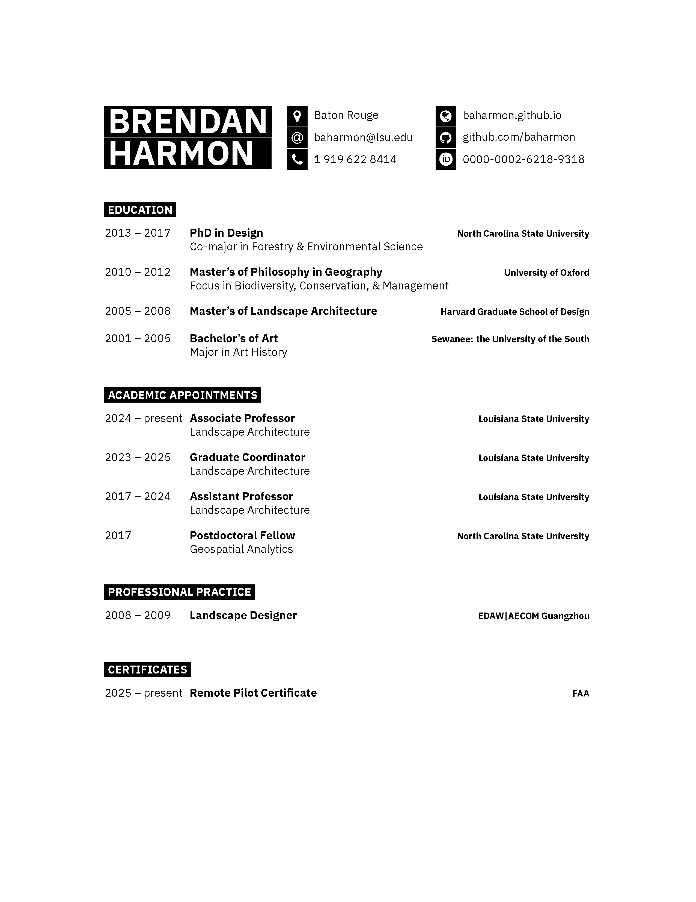

# Curriculum Vitae

My curriculum vitae
typeset in XeLaTeX with
IBM Plex,
XITS Math,
Font Awesome, and
Academic Icons.
Derived from the
Developer CV template by
Jan Vorisek (jan@vorisek.me),
Jan Küster (info@jankuester.com), and
Vel (vel@LaTeXTemplates.com).
Released under The MIT License.

